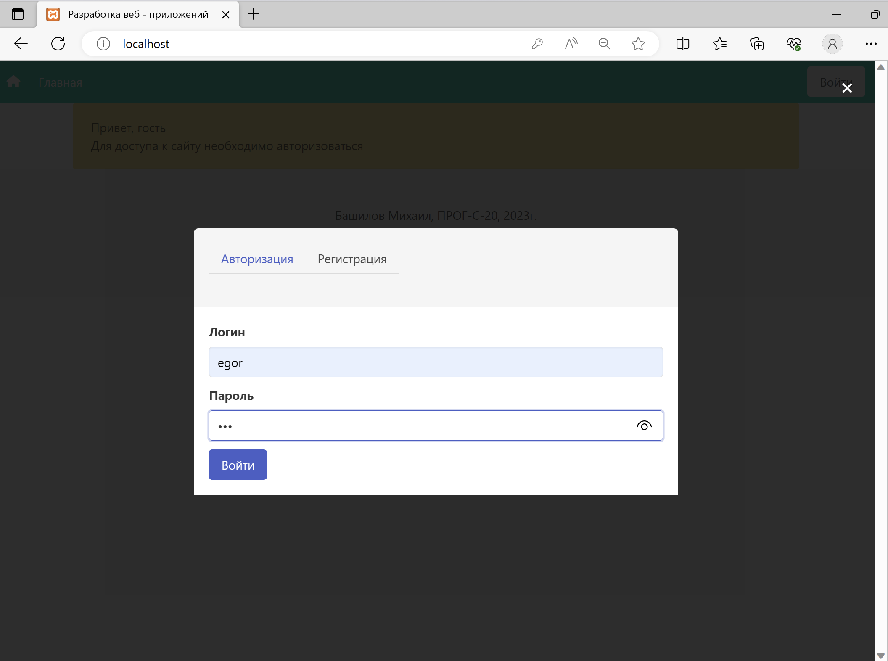
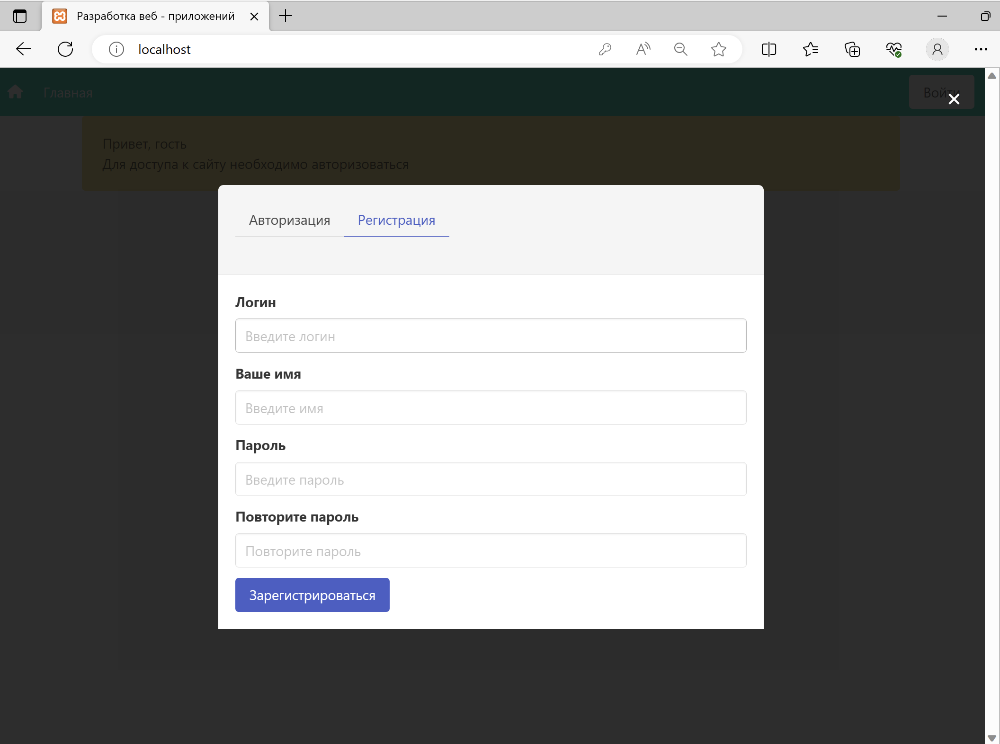

# Configuration

`config.php` required to run this project. It should contain database connection parameters in following format:

```php
<?php
    define('DB_SERVER', 'localhost');
    define('DB_USERNAME', 'root');
    define('DB_PASSWORD', '');
    define('DB_NAME', 'example_2022_PTI');
?>
```

# Screenshots





